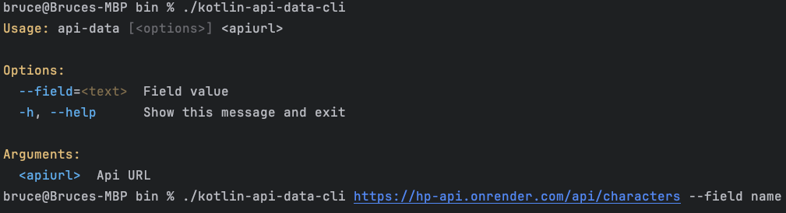

# Kotlin Api Data Cli

## Requirements

- Java 21

## Tech stack

- Kotlin
- Clikt (https://ajalt.github.io/clikt/)
- kotlinx.serialization

## Running

You can run your application in dev mode that enables live coding using:

```shell script
./gradlew installDist
```

only args (api url) is required


